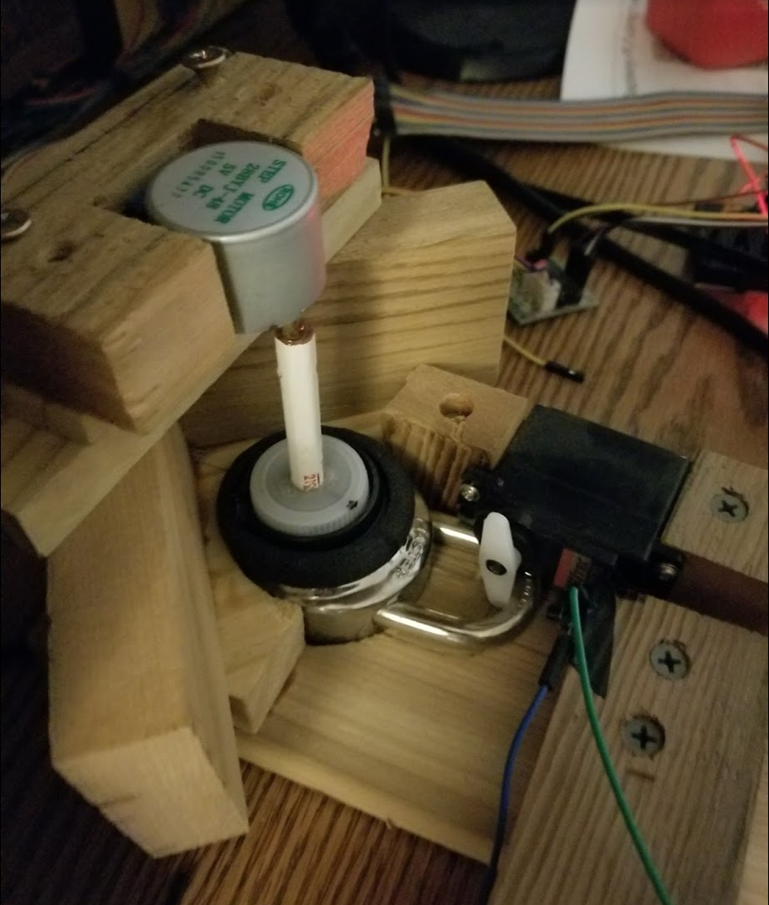

# Lock Decombinator

From [NerdLab Projects](https://nerdlabprojects.com/projects/8)

May 9, 2022

> *Updated at: May 10, 2022*

A fun exercise to brute for a master lock combination if you forgot it.

This has been an idea of mine that I have wanted to build ever since forgetting a combo for one of my locks. Yes I know there are ways to limit the amount of combinations down to a manageable amount, but what fun is that?

### Tools Used:

 * 3D printer - I have an old modified Maker select
 * [Cheap Hobby File Set](https://amzn.to/3KXW656)
 * [Hatchbox PLA filament](https://amzn.to/3Pak0h6) (my preferred filament)
 * [Soldering Iron](https://amzn.to/3w6ndXP) - I really like the cordless version from Hakko
 * Allen wrench - 2.5mm (optional)

### Materials Used:

 * Masterlock combination lock ([If you don't have one and want to buy a cheap $3 one](https://amzn.to/38brHDk))
 * [Jumper wires](https://amzn.to/3w86KAQ)
 * [OLED I2C Display Module](https://amzn.to/3FsKS7H)
 * [ELEGOO UNO R3 Board ATmega328P](https://amzn.to/3KXThBf)
 * [MG996R 55g Metal Gear Torque Digital Servo Motor](https://amzn.to/3snNUEW)
 * 3 buttons/switches (If you dont have these on hand, [here](https://amzn.to/3kTEJrH) is an assortment package.)
 * 2x 10k resistors (More resistors than you will ever need [here](https://amzn.to/39BDNWr).)
 * [Perf Board](https://amzn.to/3L1ywo6) or any [bread board](https://amzn.to/3LXjiSo)
 * [Cheap stepper motor with driver](https://amzn.to/3kVdkWo)
 * 2x m3 hex bolt and nut - [Great variety pack](https://amzn.to/3vXJ6Ze)

### Files:

 * [Decombinator v44.f3z](./physical/Decombinator%20v44.f3z)
 * [Decombinator v44.step](./physical/Decombinator%20v44.step)
 * [Base.stl](./physical/Base.stl)
 * [servo mount.stl](./physical/servo%20mount.stl)
 * [Stepper Mount.stl](./physical/Stepper%20Mount.stl)
 * [Plunger.stl](./physical/Plunger.stl)

Very first prototype from years ago that was more or less a fail do to lack of programming/design/building skills

New successful end product 

### Opening a lock

https://www.youtube.com/watch?v=IJM78OVHWlk

### Perfboard

### How to use

After wiring it all up and starting the Arduino, use the right button switch to move the combo until it is on 0. Once there, you will click the other switch to start the decombination. The LCD screen should show which combo it is trying and display the last combo tried if it opens the lock.

### Circuit

### Code

See [decombo.ino](./decombo.ino)

### Things learned/Struggles:

 * Pins 2 and 3 are the only pins you can use for interrupts.
 * There are 2038 steps per rev in the stepper motor I used - not 2048 like some tutorials said.
 * If your stepper motor is not super strong, attempting to open the lock will sometimes move the number a half number.
 * Ran into a lot of memory issues with all the combinations as a String array.  [Fordi](https://github.com/Fordi) helped me solve that.

References:

* https://jonwestfall.com/wp-content/uploads/2007/08/mlock1.pdf
* https://epow0.org/~amki/car_kit/Datasheet/ELEGOO%20UNO%20R3%20Board.pdf
* https://www.youtube.com/watch?v=l9Kbr8cPqOE - soldering perfboard